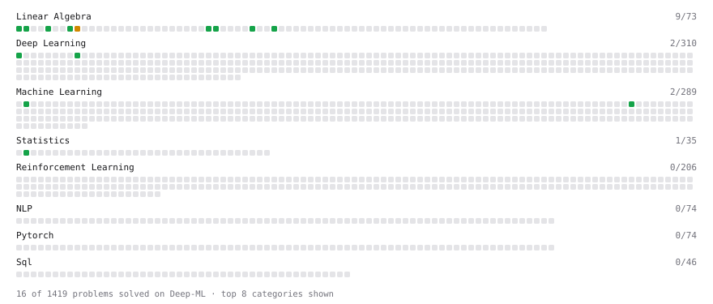

# Deep-ML

My machine learning practice from [Deep-ML](https://www.deep-ml.com). Every solution here was written by hand.

**16** solved · 10 problems · 0 labs · 6 math

[**Browse the interactive portfolio**](https://sketchverse88-ux.github.io/deep-ml/) to replay this filling in over time.

## Problems

| | Difficulty | Solved | |
| --- | --- | --- | --- |
| [Calculate Cosine Similarity Between Vectors](https://www.deep-ml.com/problems/76) | easy | 2026-09-12 | [solution](problems/0076-calculate-cosine-similarity-between-vectors) |
| [Derivative of a Polynomial](https://www.deep-ml.com/problems/116) | easy | 2026-09-13 | [solution](problems/0116-derivative-of-a-polynomial) |
| [Dot Product Calculator](https://www.deep-ml.com/problems/83) | easy | 2026-09-12 | [solution](problems/0083-dot-product-calculator) |
| [Implement ReLU Activation Function](https://www.deep-ml.com/problems/42) | easy | 2026-09-13 | [solution](problems/0042-implement-relu-activation-function) |
| [Matrix-Vector Dot Product](https://www.deep-ml.com/problems/1) | easy | 2026-09-12 | [solution](problems/0001-matrix-vector-dot-product) |
| [Scalar Multiplication of a Matrix](https://www.deep-ml.com/problems/5) | easy | 2026-09-12 | [solution](problems/0005-scalar-multiplication-of-a-matrix) |
| [Transpose of a Matrix](https://www.deep-ml.com/problems/2) | easy | 2026-09-12 | [solution](problems/0002-transpose-of-a-matrix) |
| [Vector Element-wise Sum](https://www.deep-ml.com/problems/121) | easy | 2026-09-12 | [solution](problems/0121-vector-element-wise-sum) |
| [Vector Norms (L1/L2/L-inf) and the Frobenius Norm](https://www.deep-ml.com/problems/328) | easy | 2026-09-12 | [solution](problems/0328-vector-norms-l1-l2-l-inf-and-the-frobenius-norm) |
| [Matrix times Matrix ](https://www.deep-ml.com/problems/9) | medium | 2026-09-13 | [solution](problems/0009-matrix-times-matrix) |

## Math

| | Difficulty | Solved | |
| --- | --- | --- | --- |
| [Derivatives and Gradients](https://www.deep-ml.com/math-problems/1) | easy | 2026-09-13 | [solution](math/0001-derivatives-and-gradients) |
| [Gradient Descent Updates](https://www.deep-ml.com/math-problems/5) | easy | 2026-09-13 | [solution](math/0005-gradient-descent-updates) |
| [Matrix Basics](https://www.deep-ml.com/math-problems/9) | easy | 2026-09-11 | [solution](math/0009-matrix-basics) |
| [Vector Operations](https://www.deep-ml.com/math-problems/7) | easy | 2026-09-11 | [solution](math/0007-vector-operations) |
| [Matrix Multiplication](https://www.deep-ml.com/math-problems/10) | medium | 2026-09-11 | [solution](math/0010-matrix-multiplication) |
| [Vector Norms and Linear Independence](https://www.deep-ml.com/math-problems/8) | medium | 2026-09-12 | [solution](math/0008-vector-norms-and-linear-independence) |

---

_This file is regenerated by Deep-ML on every push._
